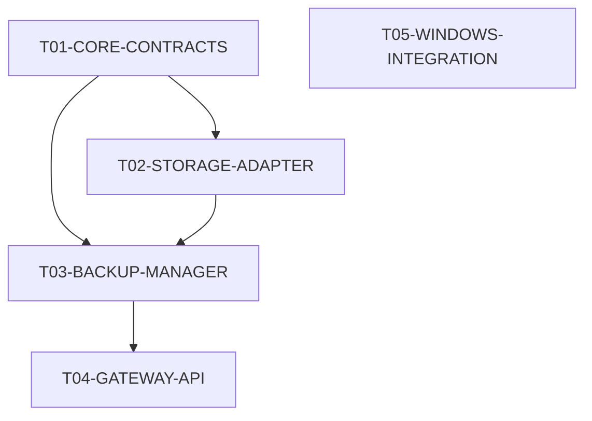

# Parallel Execution Plan

## Task Waves and Dependency Graph

### Wave 1
- **Tasks**: `T01-CORE-CONTRACTS`, `T05-WINDOWS-INTEGRATION` (Blocked).
- **Concurrency**: 1-2 sessions.
- **Description**: Foundation schemas and independent ops scripts.

### Wave 2
- **Tasks**: `T02-STORAGE-ADAPTER`
- **Concurrency**: 1 session.
- **Description**: Relies on T01 types.

### Wave 3
- **Tasks**: `T03-BACKUP-MANAGER`
- **Concurrency**: 1 session.
- **Description**: Relies on the adapter (T02) to perform isolated writes.

### Wave 4
- **Tasks**: `T04-GATEWAY-API` (Blocked).
- **Concurrency**: 1 session.
- **Description**: Integrates the backup manager and schemas into the web framework.

## Execution Rules

1. **Isolation**: Each Jules session will check out a dedicated feature branch named `feature/<task_id>`.
2. **Path Ownership**: A session executing T02 is physically forbidden from editing `src/common/types.py`. If a contract change is needed, the session must pause, report the mismatch, and await a designated "CoreTeam" session to update T01.
3. **Integration Triggers**: Merging a feature branch triggers cross-module tests automatically.
4. **Failure Handling**: If a task fails its acceptance criteria in CI, a new independent session is provided the test output and the exact branch to fix the specific errors, without starting from scratch.
5. **Concurrency Limits**: Do not exceed 5 concurrent sessions to preserve human review bandwidth.

## Limitations
If independent Git branches are not fully supported by the Jules orchestration environment, sessions will execute serially on `main` in strict Wave order.
